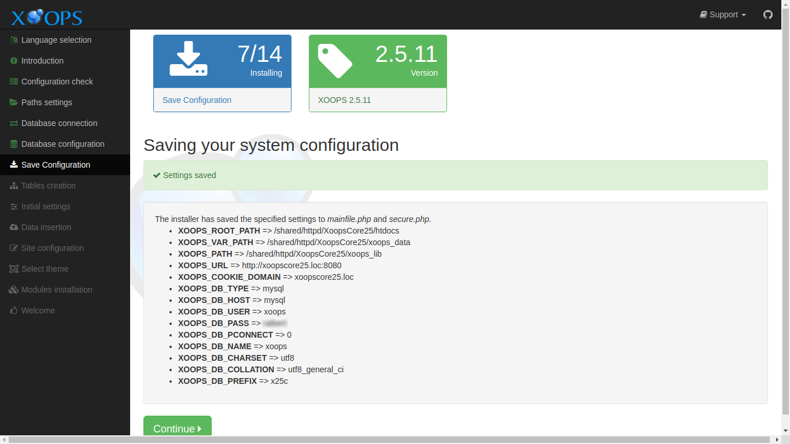
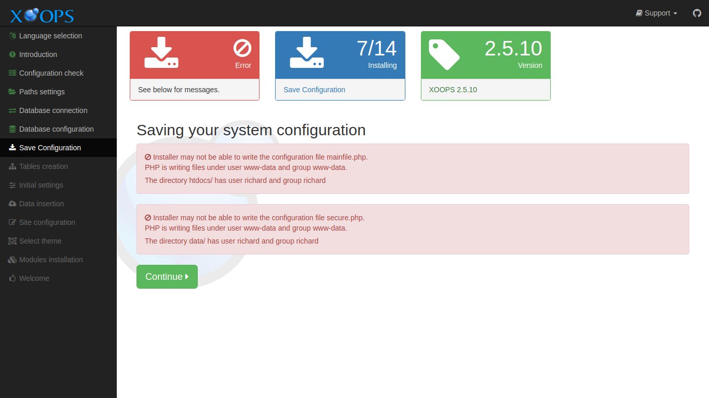

# Save Configuration​

This page displays the results of saving the configuration information you have entered up to this point.

After reviewing and correcting any issues, select the "Continue" button to proceed.

## On Success

The _Saving your system configuration_ section shows the information that was saved. The settings are saved in one of two files. One file is _mainfile.php_ in the web root. The other is _data/secure.php_ in the _xoops\_data_ directory.



## Errors

If XOOPS detects errors in writing the configuration files, it will display messages, detailing what is wrong.



In many cases, a default install of a Debian-derived system using mod\_php in Apache is the source of errors. Most hosting providers have configurations that do not have these issues.

### Group permission issues

The PHP process is run using the permissions of some user. Files are also owned by some user. If these two are not the same user, group permissions can be used to allow the PHP process to share files with your user account. This usually mean you need to change the group of the files and directories XOOPS needs to write to.

For the default configuration mentioned above this means the _www-data_ group needs to be specified as the group for the files and directories, and those files and directories need to be writable by group.

You should review you configuration carefully, and carefully choose how to resolve these issues for a box available on the open internet.

Example commands could be:

```text
chgrp -R www-data xoops_data
chmod -R g+w xoops_data
chgrp -R www-data uploads
chmod -R g+w uploads
```

### Cannot create mainfile.php

In Unix-like systems, the permission to create a new file depends on permissions granted on the parent folder. In some cases that permission is not available, and granting it may be a security concern.

If you have a problem configuration, you can find a dummy _mainfile.php_ in the _extras_ directory in the XOOPS distribution. Copy that file into the web root and set the permissions on the file:

```text
chgrp www-data mainfile.php
chmod g+w mainfile.php
```

### SELinux Environments

SELinux security contexts can be a source of problems. If this might apply, please refer to [Special Topics](../specialtopics.md) for more information.
